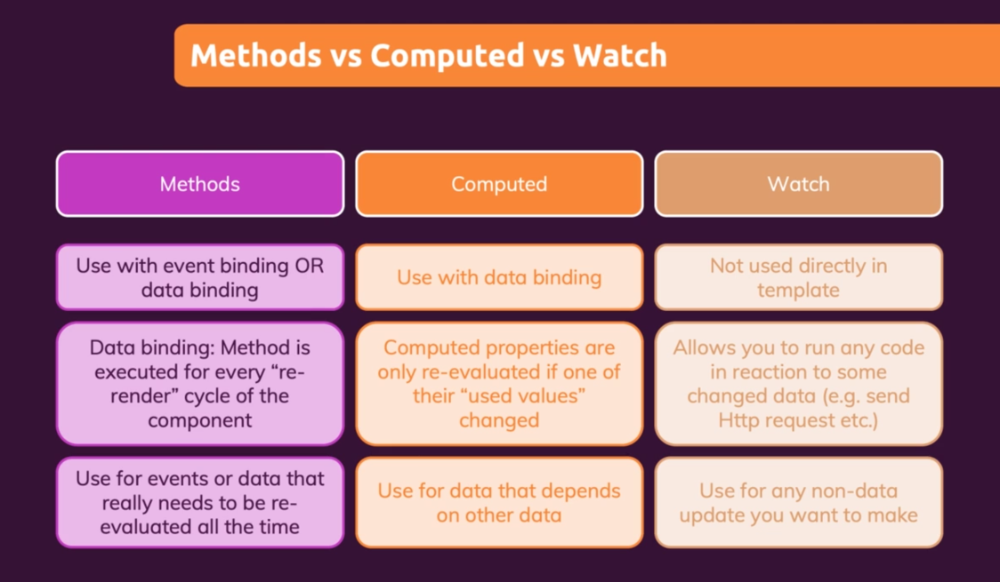

# Course notes

## Section 1: Getting started

## Section 2: Basics and core concepts → DOM interaction with vue

Setup to control a part of the HTML with Vue:

- make a vue app → `const app = Vue.createApp()`
- link html to that app → `app.mount('<css-selector-of-html-part-we-want-to-control>')`
- interacting to the html → passing an object to the app.
    - data property (function) that returns an object which values that can be used inside the template

    ```javascript
    Vue.createApp({
        data() {
            return {
                courseGoal: 'some goal'
            };
        }
    });
    ```

- Binding with data via string interpolation: `{{ coarseGoal }}`
- Binding html attributes to data: `<a v-bind:href="vueLink" ></a>`  -> `v-bind:<attribute name>`
- shorthand: `:<attribute name>`
- Methods in vue:
    - add extra option/property that we set on the object that is passed to the vue-app.
    - property is an object of functions

    ```javascript
    Vue.createApp({
        data() {
            return {
                courseGoal: 'some goal'
            };
        },
    methods: {
        outputGoal(){ "some function content with a return value"}
        }
    });
    ```

- Accessing the data property from inside the vue app → this.someDataProperty
    - Vue merges everything inside one object → thats why this works
- Outputting raw html: `v-html`

- Event binding: `v-on:<html-event-name>`
  - shorthand: `@<event-name>` 
  - [official docs](https://v3.vuejs.org/guide/events.html#event-handling) 
  - Getting the native dom-event inside the eventhandler:
    - when you dont need to pass any other argument -> call the method reference inside html, browser will pass the even automatically as an argument to the eventhandler
    - when you do need to pass another argument (or want to explicitly pass the event) -> pass `$event`
  ```javascript
  
    // passing the methodreference instead of calling the method! 
    <input v-on:input="setName"> 
  // passing the event explicityl 
    <input v-on:input="setName($event)"> 
  
    setName(event){
        this.name = event.target.value;    
    } 
  ```
  - Event modifiers:
    - [Docs](https://v3.vuejs.org/guide/events.html#event-modifiers)
    - add a `.` after the event name -> `v-on:submit.prevent`
  - Locking content
    - using `v-once` -> data binding is only evaluated once!
  - Two-way binding: 
    - `v-model="dataProperty"` directive
  - Since vue does not know the result of a function, it will always re-render the template-parts that have binding to a function! (Does vue have something like reacts memoization ???)
    - -> methods/functions are not an ideal solution to display dynamicly calculated values!
    - -> use computed properties
  - computed properties:
    - have dependencies
    - vue will only re-evaluate them when a depency changed (like memoization in react!!!)
    - add to the object passed to your react app
    ```javascript
    {
       computed: {
    
       }  
    }

    ```
    - name them like properties (not like methods) because we use them as properties -> we pass the methodreference and let vue handle when to call them!
    - use only for displaying something!
  - watchers:
    - function that is run by vue whenever one of its dependencies changes (runs every time a dependency changes vs only runs when a dependency changes and an evaluation of the template is done (computed values))
    ```javascript
    {
       watch: {
           <one-of-the-property-names-we-want-to-wacht>(newValue, oldValue){
            //do something based on the last value of the property being watched
           }
       }  
    }
    ```
  - Methods vs computed properties vs watchers:
     - 
  - Dynamic styling:
    -  
      
## Section 3: Rendering conditional content and lists

## Section 4: Course project: The monster slayer game

## Section 5: Vue, behind the scenes

## Section 6: Introducing components

## Section 7: Moving to a better development setup and workflow with Vue CLI

## Section 8: Component communitcation

## Section 9: Diving deeper into components

## Section 10: Course project: The learning resources app

## Section 11: Forms

## Section 12: Sending Http Request

## Section 13: Routing: Building a multi-page SPA

## Section 14: Animations and Transitions

## Section 15: Vuex

## Section 16: Main projects: Find a coach - app

## Section 17: Vue and authentication

## Section 18: Optimizing and deploying vue apps

## Section 19: The composition API: Replacing the Options API

## Section 20: Reusing functionality: Mixins and custom composition functions

## Section 21: Roundup and next steps

## Section 22: Migrating Vue2 to Vue3
