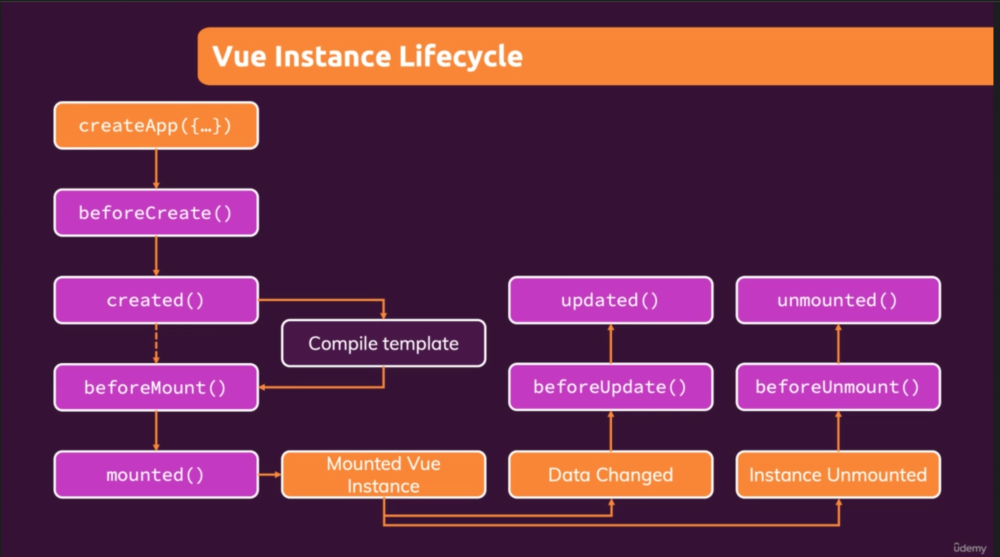

# Course notes

## Section 1: Getting started

## Section 2: Basics and core concepts → DOM interaction with vue

Setup to control a part of the HTML with Vue:

- make a vue app → `const app = Vue.createApp()`
- link html to that app → `app.mount('<css-selector-of-html-part-we-want-to-control>')`
- interacting to the html → passing an object to the app.
    - data property (function) that returns an object which values that can be used inside the template

    ```javascript
    Vue.createApp({
        data() {
            return {
                courseGoal: 'some goal'
            };
        }
    });
    ```

- Binding with data via string interpolation: `{{ coarseGoal }}`
- Binding html attributes to data: `<a v-bind:href="vueLink" ></a>`  -> `v-bind:<attribute name>`
- shorthand: `:<attribute name>`
- Methods in vue:
    - add extra option/property that we set on the object that is passed to the vue-app.
    - property is an object of functions

    ```javascript
    Vue.createApp({
        data() {
            return {
                courseGoal: 'some goal'
            };
        },
    methods: {
        outputGoal(){ "some function content with a return value"}
        }
    });
    ```

- Accessing the data property from inside the vue app → this.someDataProperty
    - Vue merges everything inside one object → thats why this works
- Outputting raw html: `v-html`

  - Event binding: `v-on:<html-event-name>`
      - shorthand: `@<event-name>`
      - [official docs](https://v3.vuejs.org/guide/events.html#event-handling)
      - Getting the native dom-event inside the eventhandler:
          - when you dont need to pass any other argument -> call the method reference inside html, browser will pass the
            even automatically as an argument to the eventhandler
          - when you do need to pass another argument (or want to explicitly pass the event) -> pass `$event`
      
      ```javascript
      // passing the methodreference instead of calling the method! 
      <input v-on:input="setName"> 
      // passing the event explicityl 
      <input v-on:input="setName($event)"> 
  
      setName(event){
          this.name = event.target.value;    
      } 
    ```
    - Event modifiers:
        - [Docs](https://v3.vuejs.org/guide/events.html#event-modifiers)
        - add a `.` after the event name -> `v-on:submit.prevent`
    - Locking content
        - using `v-once` -> data binding is only evaluated once!
    - Two-way binding:
        - `v-model="dataProperty"` directive
    - Since vue does not know the result of a function, it will always re-render the template-parts that have binding to
      a function! (Does vue have something like reacts memoization ???)
        - -> methods/functions are not an ideal solution to display dynamicly calculated values!
        - -> use computed properties
    - computed properties:
        - have dependencies
        - vue will only re-evaluate them when a depency changed (like memoization in react!!!)
        - add to the object passed to your react app
    
      ```javascript
         export default {
            computed: {}  
         }
  
      ```
      - name them like properties (not like methods) because we use them as properties -> we pass the methodreference
        and let vue handle when to call them!
      - use only for displaying something!
    - watchers:
        - function that is run by vue whenever one of its dependencies changes (runs every time a dependency changes vs
          only runs when a dependency changes and an evaluation of the template is done (computed values))
      
      ```javascript
      {
         watch: {
             <one-of-the-property-names-we-want-to-wacht>(newValue, oldValue){
              //do something based on the last value of the property being watched
             }
         }  
      }
      ```
    - Methods vs computed properties vs watchers:
      
    - Dynamic styling:
      - TODO: complete docs here

## Section 3: Rendering conditional content and lists

### Conditionally rendering content

- `v-if`
    - -> conditional rendering -> add/remove elements from DOM
- `v-else`
    - -> has to be used on an element that comes directly after an element that has `v-if` on it!
- `v-else-if`
- `v-show `
    - -> conditional showing (display:none)
    - -> show/hide elements that are still attached to the DOM
    - -> use when certain content is constantly being hidden/shown

### Rendering lists

- `v-for="goal in goals"`
    - -> goal of goals is also supported
    - -> use goal in goals !
    - `v-for="(goal, index) in goals"`
    - `v-for="(value, key) in {name: 'tom', age: 35, address: 'VueStreet 36' }"`
    - `v-for="num in 10"`
    - `:key="<unique-identifier>`
        - -> so that vue can better track what items to add/remove from the DOM when something changes

## Section 4: Course project: The monster slayer game

## Section 5: Vue, behind the scenes

- Reactivity:
  - vue wraps your data configuration with [proxies](https://developer.mozilla.org/en-US/docs/Web/JavaScript/Reference/Global_Objects/Proxy) -> this allows vue to be notified when the data changes
- Refs:
  - you can use the `ref="""` attribute anywhere in your template to get a reference to the natice html element
  - inside the component you can access references to the html elements with `this.$refs.<refName>`
- Vue uses the virtual DOM to check what content needs to be rerendered -> better for performance then rerendering the
  entire document!
  - Vue-lifecycle: 
  

## Section 6: Introducing components

- Use components to encapsulate data and behaviour
- We can choose to use multiple apps or multiple components (SPA setup)

```javascript
const app = Vue.createApp({});

app.createComponent('html-selector-name', {
    template: ``,
    data(): {

    },
    methods: {}
});
```

## Section 7: Moving to a better development setup and workflow with Vue CLI

- Web server to load files using https
- Only reloads the parts that changed (keeping moest other state intact!)
- `vue-cli-service serve`
- .vue files (single-file-components) allow us to write components and have a different section for the template,
  javascript and the styles

```html

<template></template>
<script></script>
<style></style> -> not scoped to the component out of the box ?
```

## Section 8: Component communication

### parent -> child
- Use props !

   ``` javascript
   {
    props: [
      'name',
      'phoneNumber',
      'emailAdress'
    ]
   }
   ```
  When defining the props in the component: CamelCase !
  When using the props in the template: KebabCase !
    - Usage:
        - In component: `this.<propName>`
        - In template: `<component prop-name=""></component>`
        - Props should not be mutated !
            - either let the parent know we want to modify the data
            - or store a local copy, mutate it and know that it only changes in the component itself!
            - unidirectional dataflow !
    - Validation:
        - Instead of an array of prop-names, you can also pass an object that specifies the fields and types of those
          fields
      
          ```javascript
            props: {
               name: {
                  type: String,
                  required: true,
                  default: "John Doe"
                  validator: function (){}
               }   
            }
    
            ``` 
        - Validations are checked during development!
        - Is relevant when using typescript ? (Maybe the validator function is ... ?)
        - The following values are supported as value for type:
          - String
          - Number
          - Boolean
          - Array
          - Object
          - Date
          - Function
          - Symbol
          - Constructor function 
        - Docs: https://v3.vuejs.org/guide/component-props.html
    - Dynamic prop values:
      - Bind to the prop/attribute using `v-bind:<prop-name>`! (of just `:`)
### child -> parent
- Emit events -> `this.$emit('event-name', data)` (event name = kebab-case)
- Parent can listen on these events with `v-on:event-name="doSomething($event)"`
- To document what events can be emitted by a component -> add the `emits` to the vue-object
- `emits: ['event-name']`

  ```javascript
  {
    emits: {
        'feature-name': function(id){
            //do some validation and return true/false
        }
     }
  }
   ```
### Prop falltrough:
- Props and events added on a custom component tag automatically fall through to the **root component** in the template of that component. 
- https://v3.vuejs.org/guide/component-attrs.html
- Binding all props on a Component:
  ```javascript
    <custom-component
        v-bind="some-js-object"
    ></custom-component>
  ```
  - passes all key/value pairs as props! 
###  Provide + inject
- We can provide data in a parent/ancestor component and inject it in a child component
- This lets us avoid prop-drilling

  ```javascript
  //providing a prop/data
    export default {
        provide(){
            return {
                someProperty: this.someData;
            };
        }
    }

    //injecting a prop/data
    export default {
    // same as provided keyname
    inject: ['someProperty'];
    }
  ```
- We can also avoid having to pass events all the way up:
  - by passing callback functions as props(provided) to the childcomponents which should be called upon event emission
- QUESTIONS:
  - Which one is more readable/easy to backtrace in the code
  - By using this our components assume someone provided the data/function they need 
    - --> seems like a bad idea for reusable components
         

## Section 9: Diving deeper into components
### Local vs global components
  - app.component(...) ->  global component
    - global components need to be downloaded on app init
    - often used for shared components
  - we can also import components in the script section of another component and then add it to the config object -> local component

```javascript
components: {
    tag: componentConfigObject
}
```
Shortcut:

```javascript
 components:{
    TheHeader
}
-> we can now use <TheHeader/> (self closing tag)
```

### Styles:

  - even though css is written iside the <styles> brackets of a component, it does NOT mean that it is scoped to that component!
  - Good practice: write shared styles in AppComponent (see angular styles.scss...)
  - to have your styles scoped add the scoped property to the style tags-> `<style scoped></style>`
    - vue adds `data-v-hash`attribute to your component and the scoped styles
    
### Slots

  - -> content projection (inject a component/template into a wrapper component)

```html
<template>
    <slot>
<!--        injected content goes here-->
    </slot>
</template>
```
 - named slots: when you want to use multiple slots inside one component
 - `<slot name="someName"></slot>`

```html
<template>
   <base-card>
     <template v-slot:someName>
<!--            content to project in the someName slot-->
    </template>
   <template v-slot:default>
<!--            content to project in the unnamed/default slot-->
   </template>
   </base-card>
</template>
```
 - shorthand notation for `v-slot:slotname` -> `#slotname`
 - default content: to render when no other content was passed

```html
<template>
    <slot>
        <div>some default content</div>
    </slot>
</template>
```
 - to check the content of your slots in JS -> `this.$slots`

### Scope slots

 - when you want to give the parent component that passes the markup into the slot, access to the data inside the child component (to decide how to render it)
 - child component

```html
<template>
    <div v-for="goal in goals">
        <slot v-bind:item="goal"></slot>
    </div>
</template>
```
 - parent component

```html
<child-component>
    <template v-slot:default="slotProps">
        <h2>{{slotProps.item}}</h2>
    </template>
</child-component>
```
- when you only have one slot you can omit the template tags:

```html
<child-component v-slot:default="slotProps">
        <h2>{{slotProps.item}}</h2>
</child-component>
```
### Dynamic components
- Vue provides us with the `<component>` tag with attribute `is`

```html
<component v-bind:is="selectedComponent"></component>
<!--selecteComponent holds the selector value of a component-->
```
 - when <component> renders a new component, the old one and its state is destroyed!
   - if you want to keep the state of the old component so that when it is re-enabled, the state is still there -> use `<keep-alive>`
   
```html
<keep-alive>
    <component v-bind:is="selectedComponent"></component>
</keep-alive>
```

### Teleporting elements

 - often used for accessibility reasons
   - example: to not have modals nester somewhere in the html we can teleport them to <body> -> better for screen-readers!
   
```html
<teleport to="someCssSelector">
<!-- some html   -->
</teleport>
```

### Folder and file structure
 - see the [official vue styleguide](https://vuejs.org/style-guide/)

## Section 10: Course project: The learning resources app

## Section 11: Forms

## Section 12: Sending Http Request

## Section 13: Routing: Building a multi-page SPA

## Section 14: Animations and Transitions

## Section 15: Vuex

- What and why
  - Global state management
  - TODO: add image here
- Intall VueX
- `npm install vuex`
- Adding vuex to the application

```javascript
const store = createStore(
    {
        state(){
            return {
                counter: 0
            }
        }
    }
);
```
- Accessing the store in components:

```javascript
$store.state.counter;
```

- Modifying state:
  - Use mutations
  - Passing date to mutations with payloads
```javascript
const store = createStore(
    {
        state(){
            return {
                counter: 0
            }
        },
       mutations: {
        increment(state, payload) {
            state.counter = state.counter + payload.value;
        }
       }
    }
);
```

```javascript
this.$store.commit('increment', {value: 10});
```
 Or alternativly:
```javascript
this.$store.commit({
    'increment',
    value: 10
});
```


## Section 16: Main projects: Find a coach - app

We skipped this section

## Section 17: Vue and authentication

## Section 18: Optimizing and deploying vue apps

## Section 19: The composition API: Replacing the Options API

### Intro
* Added in vue3
* Different way of building our components
* Optional
* Until now we use the "options api" (define a configuration object)
* Introduced because we MIGHT encounter 2 issues in bigger applications:
  1. Code that belongs together logically, is split up over multiple options (data, methods, computed)
  2. Re-using logic across components can be tricky and cumbersome
  3. data(), methods, cumputed & watch => setup() + different life-cycle hooks
  
### Replacing 'data' withh 'refs'

* ref() creates a reactive value

```javascript
export default {
    setup(){
        const userName = ref('Thomas');
        // return an object with the values we want to expose to our template 
        return {username}
    }
}
```

* updating refs:
```javascript
// don't reassing username -> we will loose reactive reference
username.value = 'newValue';
```

* be carefull what you expose when working with object refs. A ref is a proxy. Exposing the ref.value.property, does not expose the proxy -> vue does not know something changed!
* an alternative to `ref()` for objects is the `reactive()` funtion (made for objects, works ONLY with objects) 
   -> does not wrap an extra proxy around the object 
   -> we can expose the entire reactive object instead of the ref.value 
* when working with refs:
  * in template: you can omit the `.value` part, vue does this automatically
  * in javascript: use `.value` to access the actual value instead of the proxy

### Replacing 'data' with regular functions
* define a new function in the setup() method + export it via the return value

### Replacing computed properties with the computed function
* `import {computed} from 'vue'`
* the computed function has 1 argument -> another function
* vue checks if the dependencies changed -> function is executed everytime a dependencie changes
* computed properties are read-only refs!
```javascript
//firstname and lastname are refs in this case
const userName = computed(() => {firstname.value + ' ' + lastname.value})
```
### 2way binding with the composition API
* vue 2way-binding also accepts refs! -> not much changes, you just need to make sure to expose the ref you want to use in the tamplate..

### Watchers in the composition API
* one dependency
```javascript
watch(dependency, function(newValue, oldValue))
```
* more dependencies
```javascript
watch(dependency[], function(newValue[], oldValue[]))
```

### Some special cases to keep in mind when working with the composition API:
#### Working with template refs
* In the options API:
  * `<button ref="okButton"></button>`
  * we could access refs via `this.$refs.okButton`
* Composition API:
  * `<button ref="okButton"></button>`
  * ```javascript
    setup(){
        const okButton = ref(null)
        return {okButton};
    }

    ```
  * We need to manually create the ref and expose it in order for vue to be able to bind it!
#### Working with components & props
* We can no longer access props via `this.propName`
* Props is the first argument passed by vue to the setup() method!
* Props is a ref -> vue can detect changes in it and re-run any code that depends on it!
```javascript
props: ['firstName', 'lastName'],
setup(props){
    const userName = computed(() => {
        return props.firstName + ' ' + props.lastName
    })
}
```

#### Emitting custom events
* We can no longer user `this.$emit()`
* Second parameter to the setup method = context
* `context.emit()`

#### Working with provide/inject
* `import {provide} from 'vue'`
* `provide(key, value)`
* `import {inject} from 'vue'`
* `const foo = inject(keyName)`

### Lifecycle hooks in the composition API 
* `setup()` runs at the same time as `beforeCreated` and `created` ! (setup replaces these hooks)
* for the other hooks, vue provides some functions
  * `beforeMount` & `mounted` => `onBeforeMount` & `onMounted`
  * `beforeUpdate` & `updated` => `onBeforeUpdate` & `onUpdated`
  * `beforeUnMount`& `unmounted` =? `onBeforeUnMount` & `onUnMounted`

### Routing in the composition API
* getting url params: 
  * pass the `props=true` option to the route ->  params will be part of the props received by the component we route to
  * use hooks/composables from the vue-router 
    * `import {useRoute} from 'vue-router'` -> get access to the current route
    * `import {useRouter} from 'vue-router'` -> get access to the router
    
### Vuex and the composition API
* `import {useStore} from 'vuex'` -> get access to the store
 
## Section 20: Reusing functionality: Mixins and custom composition functions
* options api -> mixins
* composition api -> custom composition functions (hooks)

### Reuseability concepts
* Components (style + logic)
* What is we want to re-use for example some complex search and filter functionallity accross multiple components? 
  * -> mixins (or hooks)!

#### Mixins
* extract the logic of the config object to a separate mixin file
* inside the component:
  * import the mixin
  * include it in the mixins array of the config object
```javascript
export default {
    mixins: [myMixin]
}
```
* component config can not be shared via mixins!
* vue will automatically merge multiple mixins + component options (componet options win if there are conflicts !)
* to register global mixins -> `app.mixin(myMixin)`
* disadvantages of mixins:
  * hard to understand your componets (calling methods that belong to a mixin isn't very visible)
  * when using multiple mixins with the same properties you have to keep track of the merging strategy
  * custom composition functions solve this issue!

#### Custom composition functions
* also called hooks or composables
* function names are typically prefixed with 'use'
* regular function
  * can return an object/array/..
  * can accept parameters


## Section 21: Roundup and next steps

## Section 22: Migrating Vue2 to Vue3
