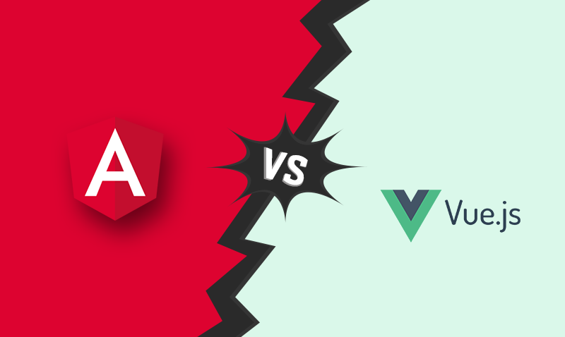

# Vue.js vs Angular

* Application
  * bootstrapping
  * spa vs multi-app
* Components
  * Registering components 
* Conditional rendering
* Looping
* Data binding
* Event binding
* Component communication
  * parent -> child
  * child -> parent
  * (prop falltrough)
  * (provide and inject)
* Styling
  * scoped vs global
* Content projection
* Using references
* Dynamic component rendering
  * `<component>` vs ComponentFactory
* Routing
  * security
* Fetching data from a backend
  * error handling
  * intercepting calls 
* State management
* Cli
  * Generating a project
* Naming conventions and good practices
* Reactivity
* Change detection
* Folder structure
* Lifecycle hooks
* Teleporting elements
* Comparing best practices

[//]: # (# Table of contents)
[//]: # (1. [Introduction]&#40;#introduction&#41;)
[//]: # (2. [Some paragraph]&#40;#paragraph1&#41;)
[//]: # (    1. [Sub paragraph]&#40;#subparagraph1&#41;)
[//]: # (3. [Another paragraph]&#40;#paragraph2&#41;)
[//]: # ()
[//]: # (## This is the introduction )
[//]: # (Some introduction text, formatted in heading 2 style)
